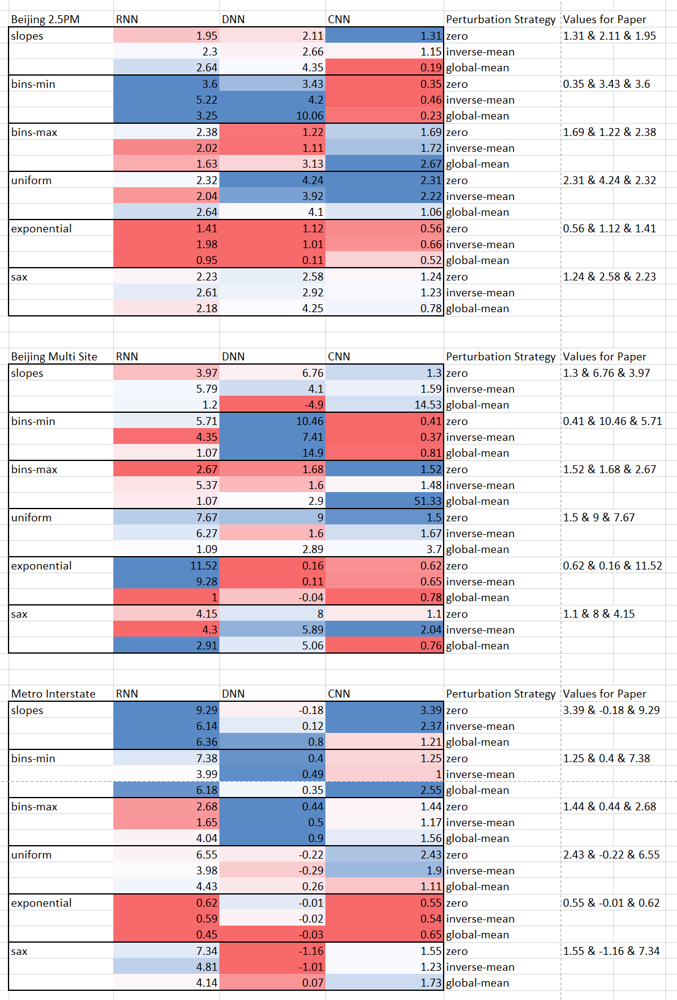

# Time Series Multivariate and Univariate Local Explanations (TS-MULE)

Repository for the paper "Local Interpretable Model-Agnostic Explanations For Time Series Forecast Models" submitted to AIMLAI 2021.
It is a general extension of LIME [1] for univariate and multivariate time series.
We therefore extend LIME with a selection of segmentation algorithms for input data.
Further, strategies for the perturbation of the segmented input data is presented.

# Ideas and Usage
We focus on six different segmentation ideas:  
 - uniform segmentation based on a fixed window size
 - exponential segmentation based on a exponentially growing wndow
 - SAX segmentation based on the SAX transformation to symbols
 - Slopes segmentation based on the gradient of the matrix profile
 - Bins-min segmentation based on a binning variant of the matrix profile
 - Bins-max segmentation based on a binning variant of the matrix profile
  
And three different replacement strategies:
 - Zero
 - Inverse
 - Mean

# Results
We evaluate the previous proposed segmentation algorithms for TS-MULE with a perturbation analysis based on Schlegel et al. [2].
In our paper, we focused on zero perturbation, but we als have the results for zero, inverse-mean, and global-mean.  
  
  
The color scale ranges from blue (best) to red (worst).  
In general, we advise to use uniform or one of the bins (e.g., bins-min) for short window lengths.   
For larger window lengths, we suggest slopes as it works best, but also the bins (e.g., bins-min) work quite well.  
  
A larger evalaution for the replacement approaches is planned but not yet done.  

# Acknowledgments
This project has received funding from the European Union’s Horizon 2020 research and innovation programme under grant agreement No. 826494.

# References

[1]: Ribeiro, M. T., Singh, S., & Guestrin, C. (2016, August). "Why should i trust you?" Explaining the predictions of any classifier. In Proceedings of the 22nd ACM SIGKDD international conference on knowledge discovery and data mining (pp. 1135-1144).  
[2]: Schlegel, U., Arnout, H., El-Assady, M., Oelke, D., & Keim, D. A. (2019). Towards A Rigorous Evaluation Of XAI Methods On Time Series. In 2019 IEEE/CVF International Conference on Computer Vision Workshop (ICCVW) (pp. 4321-4325).
